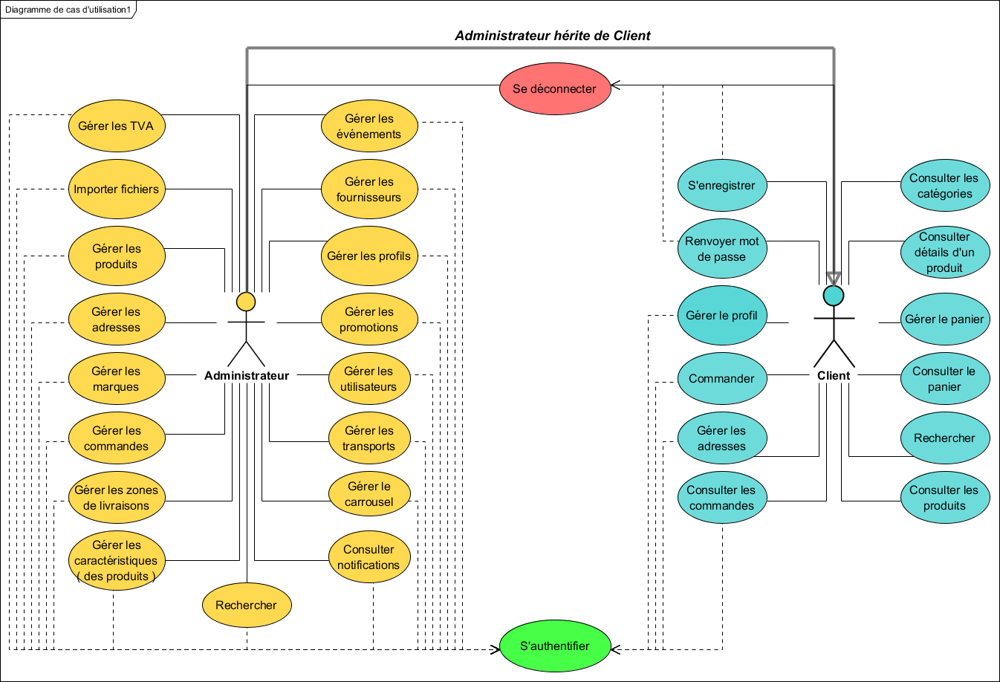

# Online Store Website (2014)
This project was done during my professional degree in computer science and has been sent to ShowRoomUnivers company.
It was about to create an online store where customers could buy some articles.  

Use case :

Models / Database : 

Technologies : 
- Symfony2 (PHP Framekwork)
- Bootstrap / Foundation
- JQuery ( ajax call - animations)
- HTML
